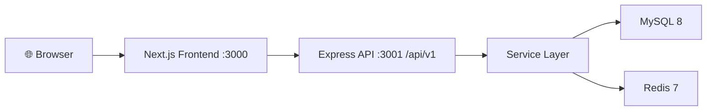
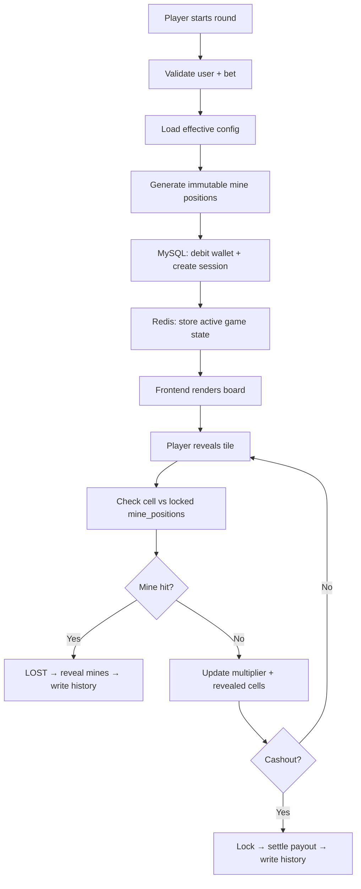
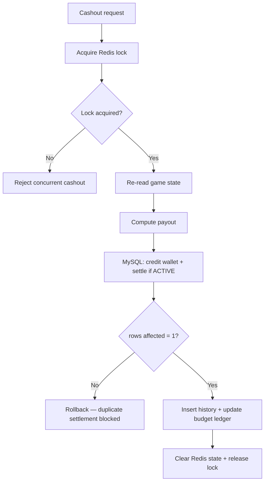
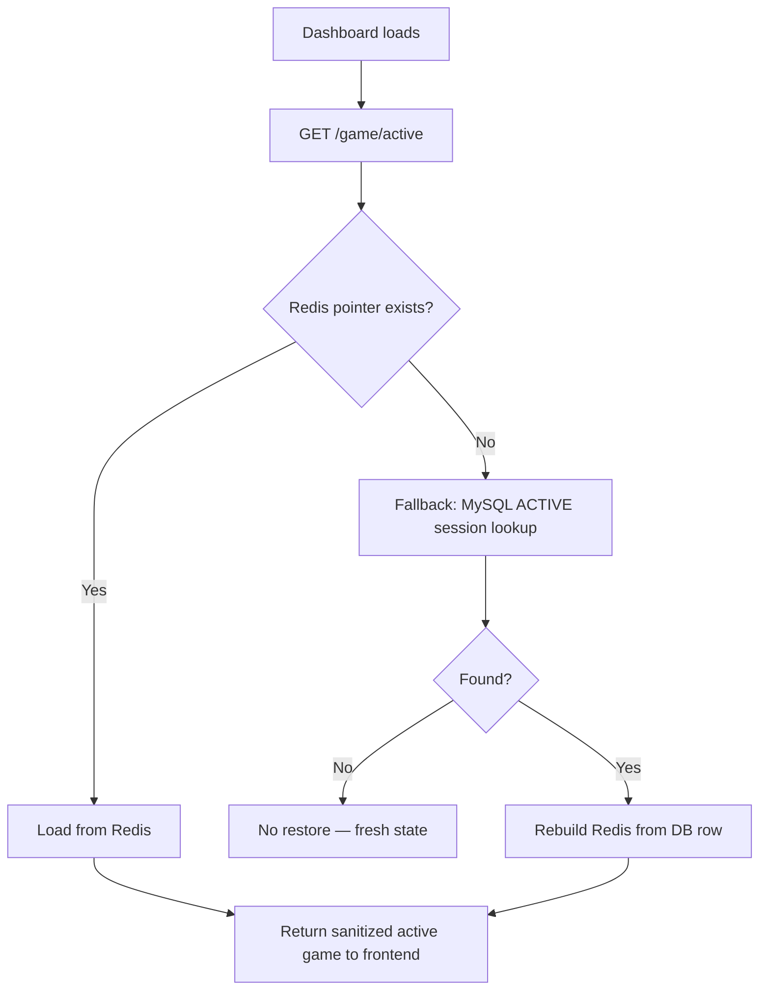

<div align="center">

# 💣 Stake Mine

**A production-ready, full-stack real-time mines casino game**

[](https://nextjs.org)
[](https://nodejs.org)
[](https://mysql.com)
[](https://redis.io)
[](https://typescriptlang.org)
[](https://docker.com)

Pick gems. Dodge mines. Cash out before it's too late.

</div>

---

## ✨ Features

| Area | What's included |
|---|---|
| 🎮 **Gameplay** | Bet, reveal tiles, live multiplier, cashout, session restore |
| 🔐 **Auth** | JWT login/register, role-based routing (Player / Admin) |
| 📈 **Progression** | XP levels, titles, missions, badges, daily rewards, leaderboard |
| 🛡️ **Fairness** | Immutable board, cryptographic mine generation, fairness API |
| 🧑‍💼 **Admin** | Runtime config, KPI dashboard, slot analytics, player visibility, audit history |
| 🎨 **UI** | Framer Motion animations, 3D tile flips, particle bursts, sparkline, mobile-first |
| 🔊 **Audio** | Lightweight generated sound feedback with mute toggle |

---

## 🖥️ Tech Stack

### Backend
- **Node.js** + **Express** — REST API
- **MySQL 8** — source of truth (wallets, sessions, history)
- **Redis 7** — active game state, distributed locks, config cache
- **JWT** — stateless authentication
- **Winston** — structured logging

### Frontend
- **Next.js 14** App Router + **TypeScript**
- **Tailwind CSS** + **Framer Motion**
- **Zustand** — client state (with localStorage persistence for preferences)
- **React Hot Toast** — in-game notifications

### Infra
- **Docker Compose** — one-command local stack
- **phpMyAdmin** — DB browser
- **RedisInsight** — Redis browser

---

## 🏗️ Architecture



### Backend Layers

```
Routes → Controllers → Services → Repositories → MySQL / Redis
```

- **Routes** — define endpoints and apply middleware
- **Controllers** — validate input, shape responses
- **Services** — enforce business rules and game logic
- **Repositories** — all persistence operations (MySQL + Redis)

---

## 📁 Project Structure

```
Stake-mine/
├── backend/
│   └── src/
│       ├── config/         # env, mysql, redis, migrations
│       ├── controllers/    # auth, game, user, admin, health
│       ├── middleware/     # auth, rate-limit, error, request logging
│       ├── repositories/   # MySQL + Redis access
│       ├── routes/         # versioned API modules
│       ├── services/       # game engine + business logic
│       ├── utils/          # response helpers
│       ├── app.js
│       └── server.js
├── frontend/
│   └── src/
│       ├── app/            # Next.js pages (/, /login, /history, /admin)
│       ├── components/     # GameBoard, GameControls, Navbar, panels
│       ├── lib/            # axios client, audio, expiry hook
│       └── store/          # Zustand stores (auth, game)
├── mysql/
│   └── init.sql            # schema + seed data
├── docker-compose.yml
└── README.md
```

---

## 🎮 Game Engine Guarantees

> These rules make the game provably fair within each round.

1. Mine positions are generated **once** at round start using cryptographically secure randomness
2. The board is **immutable** — reveals never recalculate or move mines
3. Mine positions are stored in both **Redis** (speed) and **MySQL** (durability)
4. Cashout is protected by a **Redis distributed lock** + **MySQL conditional settlement** (rows-affected check) to prevent double payouts
5. MySQL is always the **source of truth** — Redis is rebuilt from DB on recovery

---

## 🔄 Core Flows

<details>
<summary><strong>Gameplay Flow</strong></summary>



</details>

<details>
<summary><strong>Cashout Protection Flow</strong></summary>



</details>

<details>
<summary><strong>Session Restore Flow</strong></summary>



</details>

---

## 🚀 Quick Start

### Option 1 — Docker Compose (recommended)

```bash
git clone https://github.com/yashkale402/Stake-mine.git
cd Stake-mine
docker-compose up --build -d
```

| Service | URL |
|---|---|
| Backend API | http://localhost:3001 |
| Frontend | http://localhost:3000 |
| phpMyAdmin | http://localhost:8080 |
| RedisInsight | http://localhost:5540 |

### Option 2 — Local Dev

```bash
# Terminal 1 — Backend
cd backend && npm install && npm run dev

# Terminal 2 — Frontend
cd frontend && npm install && npm run dev
```

---

## ⚙️ Environment Variables

Create `backend/.env` from `backend/.env.example`:

```env
PORT=3001
MYSQL_HOST=localhost
MYSQL_PORT=3306
MYSQL_DATABASE=stake_mine
MYSQL_USER=root
MYSQL_PASSWORD=yourpassword
REDIS_HOST=localhost
REDIS_PORT=6379
JWT_SECRET=your_jwt_secret
```

---

## 🔑 Dev Accounts

| Role | Email | Password |
|---|---|---|
| Player | `yash@example.com` | `password123` |
| Player | `demo@example.com` | `password123` |
| Admin | `admin@stake.mine` | `password123` |

---

## 📡 API Reference

### Auth
| Method | Endpoint | Description |
|---|---|---|
| POST | `/api/v1/auth/register` | Register new player |
| POST | `/api/v1/auth/login` | Login, returns JWT |
| GET | `/api/v1/auth/me` | Get current user |

### Game
| Method | Endpoint | Description |
|---|---|---|
| POST | `/api/v1/game/start` | Start a new round |
| POST | `/api/v1/game/reveal` | Reveal a tile |
| POST | `/api/v1/game/cashout` | Cash out current round |
| GET | `/api/v1/game/active` | Get active session |
| GET | `/api/v1/game/history` | Game history |
| GET | `/api/v1/game/fairness` | Fairness explanation |

### User
| Method | Endpoint | Description |
|---|---|---|
| POST | `/api/v1/users/deposit` | Add balance |
| GET | `/api/v1/users/engagement` | Progression + missions + badges |
| POST | `/api/v1/users/daily-reward/claim` | Claim daily reward |
| GET | `/api/v1/users/leaderboard` | Top players |

### Admin
| Method | Endpoint | Description |
|---|---|---|
| GET | `/api/v1/admin/summary` | KPI dashboard |
| GET/PUT | `/api/v1/admin/config` | Runtime config |
| GET | `/api/v1/admin/config-history` | Config audit log |
| GET | `/api/v1/admin/players` | Recent players |
| GET | `/api/v1/admin/slots` | Slot analytics |

---

## 💡 Example Requests

```http
# Login
POST /api/v1/auth/login
{ "email": "yash@example.com", "password": "password123" }

# Start game
POST /api/v1/game/start
Authorization: Bearer <TOKEN>
{ "betAmountPaise": 1000, "mineCount": 3 }

# Reveal tile
POST /api/v1/game/reveal
Authorization: Bearer <TOKEN>
{ "gameUuid": "<UUID>", "cellIndex": 4 }

# Cashout
POST /api/v1/game/cashout
Authorization: Bearer <TOKEN>
{ "gameUuid": "<UUID>" }
```

---

## 🧪 Tests

```bash
cd backend && npm test
```

Covers: mine generation, multiplier growth, streak logic, daily reward availability, engagement profile generation.

---

## 🗄️ Data Model

| Table | Purpose |
|---|---|
| `users` | Accounts + wallet balance |
| `game_sessions` | Active and completed rounds |
| `game_history` | Settled round records |
| `global_config` | Runtime game parameters |
| `slot_configs` | Per-slot configuration |
| `slot_budget_ledger` | House P&L tracking |
| `audit_logs` | Admin action history |
| `player_config_overrides` | Per-player config overrides |

---

## 🗺️ Roadmap

- [ ] Provably-fair cryptographic proof page
- [ ] WebSocket live multiplier push (replace polling)
- [ ] Integration test suite (API-level)
- [ ] Social / referral system
- [ ] Persistent mission completion state
- [ ] Push / in-app notifications
- [ ] Stronger admin player-management actions

---

## 📄 License

MIT — built for learning and demonstration purposes.

---

<div align="center">
  Made with ❤️ by <a href="https://github.com/yashkale402">yashkale402</a>
</div>
