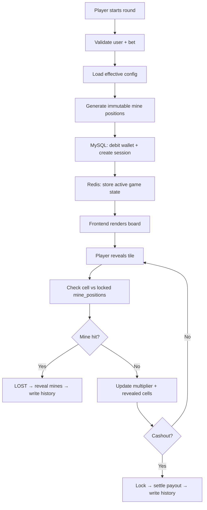
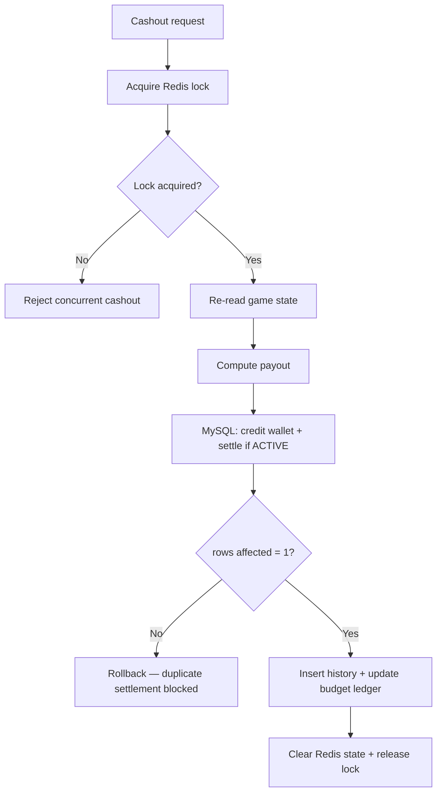
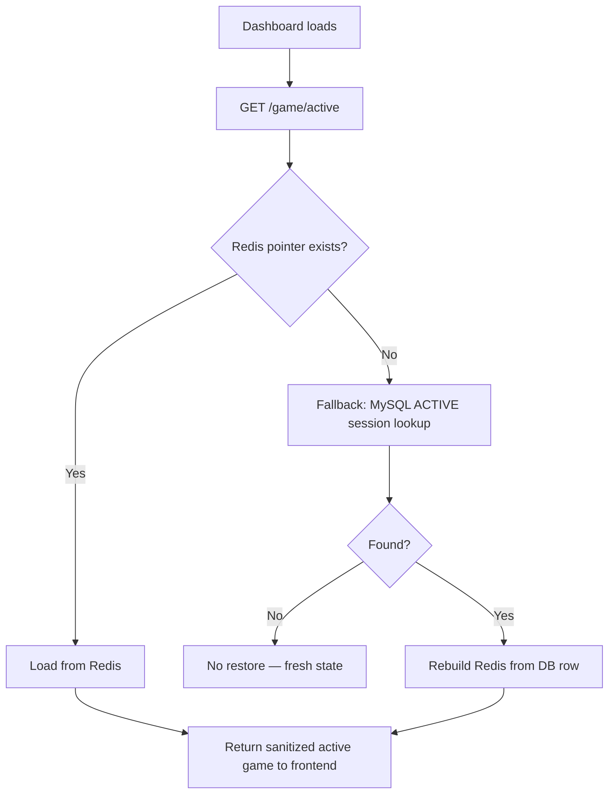

# Stake Mine

Stake Mine is a full-stack mines-style betting game with a production-style backend and modern React frontend. The app uses MySQL as the source of truth and Redis for low-latency state, caching, and coordination.

## Project overview

- **Backend**: `backend/` — Express app with layered controllers, services, repositories, Redis cache, and MySQL persistence.
- **Frontend**: `frontend/` — Next.js app with gameplay UI, auth, and admin dashboard.
- **Database schema**: `mysql/init.sql` — schema and seeded structure for users, games, budgets, and audit history.
- **Local dev orchestration**: `docker-compose.yml` — builds backend, frontend, MySQL, Redis, phpMyAdmin, and RedisInsight.

## What this repo contains

- `backend/`
  - Express REST API and Socket.IO auth
  - Game lifecycle: start game, reveal tile, cashout, settle loss/expiry
  - Budget reservations and per-slot budget tracking
  - Redis cache and distributed locks
  - MySQL persistence for wallets, sessions, history, and budget ledgers
- `frontend/`
  - Next.js 14 App Router frontend
  - Player experience screens: login, game board, history
  - Admin dashboard with runtime config and KPI views
- `mysql/init.sql`
  - MySQL schema for all production tables and developer setup
- `docker-compose.yml`
  - Local stack wiring for backend, frontend, MySQL, Redis, phpMyAdmin, and RedisInsight

## Key capabilities

- Gameplay with safe tile reveals, mine detection, and cashout.
- Risk-aware quote generation and payout capping.
- Budget-aware slot reservation system to keep per-slot exposure controllable.
- Redis-backed active game state, idempotency protection, and transaction locks.
- JWT authentication with player/admin roles.
- Local development via Docker Compose.

## Tech stack

### Backend
- Node.js 20+
- Express
- MySQL 8
- Redis 7
- JSON Web Tokens
- Winston logging
- Socket.IO for real-time user room handling

### Frontend
- Next.js 14 App Router
- React 18
- TypeScript
- Tailwind CSS
- Framer Motion
- Zustand state management
- Axios HTTP client
- Socket.IO client

### Dev tooling / Infra
- Docker Compose
- phpMyAdmin for DB inspection
- RedisInsight for Redis inspection

## Folder structure

```text
Stake-mine/
├── backend/
│   ├── Dockerfile
│   ├── package.json
│   ├── src/
│   │   ├── app.js
│   │   ├── server.js
│   │   ├── config/
│   │   ├── controllers/
│   │   ├── middleware/
│   │   ├── models/
│   │   ├── repositories/
│   │   ├── routes/
│   │   ├── services/
│   │   └── utils/
├── frontend/
│   ├── Dockerfile
│   ├── package.json
│   ├── src/
│   │   ├── app/
│   │   ├── components/
│   │   ├── lib/
│   │   └── store/
├── mysql/
│   └── init.sql
├── docker-compose.yml
└── README.md
```

## Local development

### Requirements
- Docker Desktop
- `docker compose`
- Node.js 20+ for local npm commands

### Start the full stack

```powershell
docker compose up -d
```

This starts:
- `http://localhost:3000` — frontend
- `http://localhost:3001` — backend API
- `http://localhost:8080` — phpMyAdmin
- `http://localhost:6379` — Redis
- `http://localhost:5540` — RedisInsight

### Backend dev flow

```powershell
cd backend
npm install
npm test
npm run dev
```

The backend entrypoint is `backend/src/server.js`.

### Frontend dev flow

```powershell
cd frontend
npm install
npm run dev
```

The frontend runs on `http://localhost:3000` and is configured to call the backend at `http://localhost:3001`.

## Environment variables

### Backend
Copy `backend/.env.example` to `backend/.env` and update values for your environment.

Required values:
- `PORT`
- `MYSQL_HOST`
- `MYSQL_PORT`
- `MYSQL_DATABASE`
- `MYSQL_USER`
- `MYSQL_PASSWORD`
- `REDIS_HOST`
- `REDIS_PORT`
- `JWT_SECRET`

Optional:
- `ALLOWED_ORIGIN`
- `REDIS_CACHE_TTL`
- `JWT_EXPIRES_IN`

### Frontend
Copy `frontend/.env.example` to `frontend/.env` if needed.

Required value:
- `NEXT_PUBLIC_API_URL`

## Important backend behavior

- MySQL is the source of truth for wallets, games, history, budgets, and reservations.
- Redis is used for:
  - active game state caching
  - idempotency keys
  - distributed locks
  - budget/slot reservation caches
- Game actions are designed to use MySQL transactions for all money-critical operations.
- Expired active games are processed by a server-side cron in `backend/src/server.js`.

## Game algorithms and how it works

### 1. Game start
- When a player starts a new game, the backend computes a risk profile for that session.
- It selects a mine count and house edge using the risk engine in `backend/src/services/risk-engine.js`.
- The game board is initialized by choosing unique mine positions using cryptographically-secure random bytes and a partial Fisher–Yates shuffle.
- A budget reservation is created for the round so the system can cap exposure before the player cashes out.
- The backend saves the active game state in Redis and the game row in MySQL.

### 2. Reveal cell
- The frontend requests a reveal for a chosen cell.
- The backend loads the game state from Redis, with MySQL fallback if needed.
- It checks whether the chosen cell is a mine by searching the pre-generated mine set.
- If the player hits a safe cell, the multiplier is recalculated.
- If the player hits a mine, the backend settles the loss and releases the reserved budget.

### 3. Multiplier calculation
- The visible multiplier is derived from the probability of surviving the next reveal.
- It uses a probability-based formula rather than arbitrary scaling so displayed odds reflect actual combinatorial risk.
- The multiplier increases each time a safe cell is revealed because the remaining safe probability changes.

### 4. Cashout
- Cashout is protected by a Redis lock and atomic MySQL updates.
- The backend recalculates the payout using the current multiplier and the player’s bet amount.
- The reserved budget is converted to actual used budget, the player wallet is credited, and the game is marked settled.
- Redis state for the active game is cleared after cashout.

### 5. Risk and budget control
- The risk engine adjusts difficulty dynamically based on current slot budget pressure.
- The base risk level is derived from daily slot budget usage: spent plus reserved budget versus the slot's total daily budget, using the configured thresholds from the global config (`risk_normal_threshold_pct`, `risk_low_threshold_pct`, `risk_medium_threshold_pct`, `risk_high_threshold_pct`, `risk_critical_threshold_pct`).
- The engine does not target risk based on individual player history or session loss streaks.
- The budget system maintains per-slot daily ledger rows, reservation rows, and a history audit.
- Reservations are created at game start and released on loss or expiry.
- On cashout, the reserved amount is replaced by the actual payout before the ledger is updated.

### 6. Safety and consistency
- Redis is used for speed and coordination, but MySQL always holds the final record for wallet and settlement state.
- Budget state is cached in Redis for performance, with MySQL used to recover correct state after cache misses.
- The backend design prioritizes atomic settlement paths and avoids double-processing via locks and idempotency checks.

## Core backend modules

- `backend/src/services/game.service.js` — game start, reveal, cashout, state recovery
- `backend/src/services/risk-engine.js` — dynamic mine and house edge adjustments
- `backend/src/repositories/cache.repository.js` — Redis helpers, cache keys, lock management
- `backend/src/repositories/game.repository.js` — game persistence, settlement, history
- `backend/src/services/budget.service.js` — admin budget status and reservation accounting

## Core frontend modules

- `frontend/src/app/page.tsx` — player landing / main page
- `frontend/src/app/login/page.tsx` — auth page
- `frontend/src/app/admin/page.tsx` — admin dashboard entry
- `frontend/src/app/history/page.tsx` — player history page
- `frontend/src/components/` — UI components for game board, controls, navbar, trust panel
- `frontend/src/lib/api.ts` — API wrappers for backend calls
- `frontend/src/store/` — Zustand stores for auth and game state

## Running tests

### Backend tests

```powershell
cd backend
npm test
```

### Frontend tests

Currently not configured in this repo.

## Docker Compose services

- `mysql` — MySQL 8 with initial schema mounted from `mysql/init.sql`
- `phpmyadmin` — phpMyAdmin for database inspection
- `redis` — Redis 7 for cache and locks
- `redis-insight` — RedisInsight UI
- `backend` — Node.js backend API service
- `frontend` — Next.js frontend service

## Notes

- The app is built for a development/demo workflow. In production, update secrets, use secure CORS, and add HTTPS.
- The backend uses `backend/src/config/env.js` to validate required environment variables on startup.
- The frontend Docker build uses `NEXT_PUBLIC_API_URL` and `INTERNAL_API_URL` to route browser and server-side requests.

## Useful commands

```powershell
# Start all containers
docker compose up -d

# Restart backend
docker compose restart backend

# View backend logs
docker compose logs -f backend

# Rebuild the frontend container
docker compose up -d --build frontend
```

---

## Contact

If you want, I can also add:
- an architecture diagram for game flows,
- a developer quickstart checklist,
- a separate admin API reference section.

### Backend Layers

```
Routes → Controllers → Services → Repositories → MySQL / Redis
```

- **Routes** — define endpoints and apply middleware
- **Controllers** — validate input, shape responses
- **Services** — enforce business rules and game logic
- **Repositories** — all persistence operations (MySQL + Redis)

---

## 📁 Project Structure

```
Stake-mine/
├── backend/
│   └── src/
│       ├── config/         # env, mysql, redis, migrations
│       ├── controllers/    # auth, game, user, admin, health
│       ├── middleware/     # auth, rate-limit, error, request logging
│       ├── repositories/   # MySQL + Redis access
│       ├── routes/         # versioned API modules
│       ├── services/       # game engine + business logic
│       ├── utils/          # response helpers
│       ├── app.js
│       └── server.js
├── frontend/
│   └── src/
│       ├── app/            # Next.js pages (/, /login, /history, /admin)
│       ├── components/     # GameBoard, GameControls, Navbar, panels
│       ├── lib/            # axios client, audio, expiry hook
│       └── store/          # Zustand stores (auth, game)
├── mysql/
│   └── init.sql            # schema + seed data
├── docker-compose.yml
└── README.md
```

---

## 🎮 Game Engine Guarantees

> These rules make the game provably fair within each round.

1. Mine positions are generated **once** at round start using cryptographically secure randomness
2. The board is **immutable** — reveals never recalculate or move mines
3. Mine positions are stored in both **Redis** (speed) and **MySQL** (durability)
4. Cashout is protected by a **Redis distributed lock** + **MySQL conditional settlement** (rows-affected check) to prevent double payouts
5. MySQL is always the **source of truth** — Redis is rebuilt from DB on recovery

---

## 🔄 Core Flows

<details>
<summary><strong>Gameplay Flow</strong></summary>



</details>

<details>
<summary><strong>Cashout Protection Flow</strong></summary>



</details>

<details>
<summary><strong>Session Restore Flow</strong></summary>



</details>

---

## 🚀 Quick Start

### Option 1 — Docker Compose (recommended)

```bash
git clone https://github.com/yashkale402/Stake-mine.git
cd Stake-mine
docker-compose up --build -d
```

| Service | URL |
|---|---|
| Backend API | http://localhost:3001 |
| Frontend | http://localhost:3000 |
| phpMyAdmin | http://localhost:8080 |
| RedisInsight | http://localhost:5540 |

### Option 2 — Local Dev

```bash
# Terminal 1 — Backend
cd backend && npm install && npm run dev

# Terminal 2 — Frontend
cd frontend && npm install && npm run dev
```

---

## ⚙️ Environment Variables

Create `backend/.env` from `backend/.env.example`:

```env
PORT=3001
MYSQL_HOST=localhost
MYSQL_PORT=3306
MYSQL_DATABASE=stake_mine
MYSQL_USER=root
MYSQL_PASSWORD=yourpassword
REDIS_HOST=localhost
REDIS_PORT=6379
JWT_SECRET=your_jwt_secret
```

---

## 🔑 Dev Accounts

| Role | Email | Password |
|---|---|---|
| Player | `yash@example.com` | `password123` |
| Player | `demo@example.com` | `password123` |
| Admin | `admin@stake.mine` | `password123` |

---

## 📡 API Reference

### Auth
| Method | Endpoint | Description |
|---|---|---|
| POST | `/api/v1/auth/register` | Register new player |
| POST | `/api/v1/auth/login` | Login, returns JWT |
| GET | `/api/v1/auth/me` | Get current user |

### Game
| Method | Endpoint | Description |
|---|---|---|
| POST | `/api/v1/game/start` | Start a new round |
| POST | `/api/v1/game/reveal` | Reveal a tile |
| POST | `/api/v1/game/cashout` | Cash out current round |
| GET | `/api/v1/game/active` | Get active session |
| GET | `/api/v1/game/history` | Game history |
| GET | `/api/v1/game/fairness` | Fairness explanation |

### User
| Method | Endpoint | Description |
|---|---|---|
| POST | `/api/v1/users/deposit` | Add balance |
| GET | `/api/v1/users/engagement` | Progression + missions + badges |
| POST | `/api/v1/users/daily-reward/claim` | Claim daily reward |
| GET | `/api/v1/users/leaderboard` | Top players |

### Admin
| Method | Endpoint | Description |
|---|---|---|
| GET | `/api/v1/admin/summary` | KPI dashboard |
| GET/PUT | `/api/v1/admin/config` | Runtime config |
| GET | `/api/v1/admin/config-history` | Config audit log |
| GET | `/api/v1/admin/players` | Recent players |
| GET | `/api/v1/admin/slots` | Slot analytics |

---

## 💡 Example Requests

```http
# Login
POST /api/v1/auth/login
{ "email": "yash@example.com", "password": "password123" }

# Start game
POST /api/v1/game/start
Authorization: Bearer <TOKEN>
{ "betAmountPaise": 1000, "mineCount": 3 }

# Reveal tile
POST /api/v1/game/reveal
Authorization: Bearer <TOKEN>
{ "gameUuid": "<UUID>", "cellIndex": 4 }

# Cashout
POST /api/v1/game/cashout
Authorization: Bearer <TOKEN>
{ "gameUuid": "<UUID>" }
```

---

## 🧪 Tests

```bash
cd backend && npm test
```

Covers: mine generation, multiplier growth, streak logic, daily reward availability, engagement profile generation.

---

## 🗄️ Data Model

| Table | Purpose |
|---|---|
| `users` | Accounts + wallet balance |
| `game_sessions` | Active and completed rounds |
| `game_history` | Settled round records |
| `global_config` | Runtime game parameters |
| `slot_configs` | Per-slot configuration |
| `slot_budget_ledger` | House P&L tracking |
| `audit_logs` | Admin action history |
| `player_config_overrides` | Per-player config overrides |

---

## 🗺️ Roadmap

- [ ] Provably-fair cryptographic proof page
- [ ] WebSocket live multiplier push (replace polling)
- [ ] Integration test suite (API-level)
- [ ] Social / referral system
- [ ] Persistent mission completion state
- [ ] Push / in-app notifications
- [ ] Stronger admin player-management actions

---

## 📄 License

MIT — built for learning and demonstration purposes.

---

<div align="center">
  Made with ❤️ by <a href="https://github.com/yashkale402">yashkale402</a>
</div>
