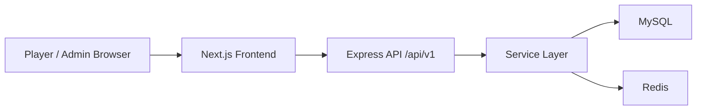
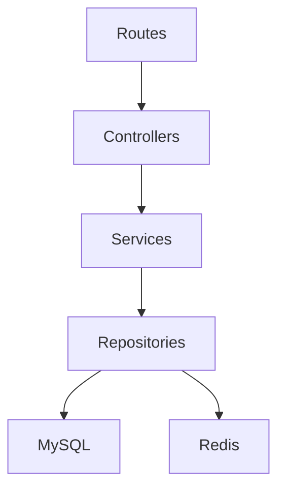
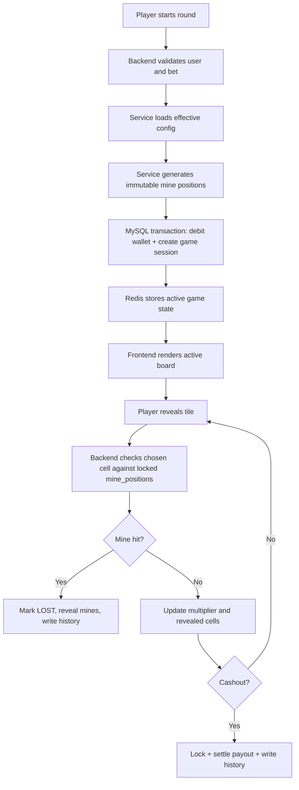
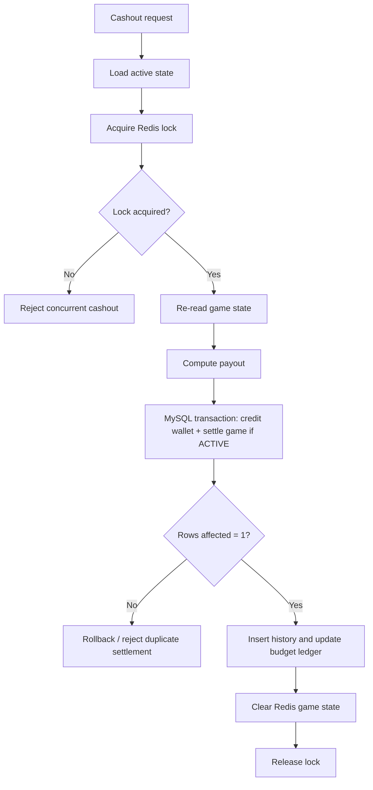
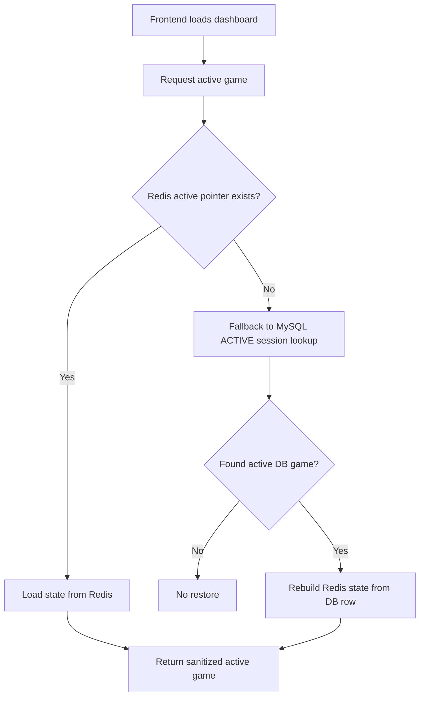

# Stake Mine

Stake Mine is a full-stack single-player mines game platform with:

- a Node.js + Express backend
- a Next.js 14 frontend
- MySQL as the source of truth
- Redis for active game state, config caching, and locks
- an admin panel for runtime control and analytics

The project keeps the game engine deterministic within each round:

- mine positions are generated once at round start
- the board does not change during play
- reveals only check the locked board state
- cashout uses layered protection to prevent double settlement

---

## Overview

Stake Mine is built around a clean layered architecture:

- Controllers handle HTTP requests and responses
- Services contain game and business logic
- Repositories isolate MySQL and Redis access
- The frontend consumes versioned APIs and manages UI state with Zustand

The current application includes:

- player login and registration
- gameplay start, reveal, cashout, restore, and history
- player progression, daily rewards, missions, badges, and leaderboard
- fairness explanation and trust surfaces
- admin config editing, slot analytics, KPI snapshots, player visibility, and config history

---

## Tech Stack

### Backend

- Node.js
- Express
- MySQL 8
- Redis 7
- JWT authentication
- Winston logging

### Frontend

- Next.js 14 App Router
- React
- TypeScript
- Tailwind CSS
- Zustand
- React Query

### Dev / Infra

- Docker Compose
- phpMyAdmin
- RedisInsight
- Node test runner

---

## Core Product Areas

### Player Side

- Login and registration
- Bet and mine selection
- Reveal flow with live multiplier updates
- Cashout flow
- Unfinished game restore
- Game history
- Tutorial and risk explanation
- Daily rewards
- Missions and badges
- Progression system
- Leaderboard
- Fairness explanation

### Admin Side

- Runtime config updates
- Slot budget visibility
- KPI dashboard
- Recent players
- Config audit history
- Experiment placeholders for A/B testing

---

## High-Level Architecture



### Backend Layering



This keeps responsibilities clear:

- routes define endpoints
- controllers validate request intent and shape responses
- services enforce business rules
- repositories perform persistence operations

---

## Project Structure

```text
Stake-mine/
├── backend/
│   ├── src/
│   │   ├── config/           # env, mysql, redis, migrations
│   │   ├── controllers/      # auth, game, user, admin, health
│   │   ├── middleware/       # auth, rate limit, error handling, request logging
│   │   ├── repositories/     # MySQL and Redis access
│   │   ├── routes/           # versioned API route modules
│   │   ├── services/         # game logic and business logic
│   │   ├── utils/            # response helpers
│   │   ├── logger/           # winston logger
│   │   ├── app.js            # express app factory
│   │   └── server.js         # bootstrap
│   ├── test/                 # backend tests
│   ├── package.json
│   └── Dockerfile
├── frontend/
│   ├── src/
│   │   ├── app/              # Next.js routes
│   │   ├── components/       # UI building blocks
│   │   ├── lib/              # api client and helpers
│   │   └── store/            # zustand stores
│   ├── package.json
│   └── tailwind.config.js
├── mysql/
│   └── init.sql              # schema and seed data
├── docker-compose.yml
└── README.md
```

---

## Game Engine Rules

These are the most important gameplay guarantees in the project:

1. Mine positions are generated exactly once at game start.
2. Generation uses cryptographically secure randomness.
3. Mine positions are stored in Redis and persisted in MySQL.
4. Reveals do not move or recalculate mines.
5. Cashout is protected by:
- Redis distributed lock
- MySQL conditional settlement
6. Redis is not the source of truth.
7. MySQL remains the persistent record for recovery and history.

---

## Main Gameplay Flow



---

## Cashout Protection Flow



---

## Restore / Recovery Flow



---

## Player Experience Systems

The current project now includes a first progression layer without changing the game algorithm:

- tutorial steps
- risk explanation
- first-win guidance
- progression titles and level thresholds
- daily reward claim flow
- computed missions
- badge collection
- limited-time event messaging
- leaderboard

These systems are currently lightweight and intentionally fit the existing architecture rather than introducing a separate event engine.

---

## Fairness Model

The project does not implement a separate provably-fair cryptographic proof page yet, but it does expose a fairness explanation through the API and UI.

Current fairness messaging explains:

- the board is generated once before play
- the board is immutable during the round
- reveals only compare against stored mine positions
- multipliers come from reveal probability adjusted by house edge

This keeps outcomes consistent with the actual engine implementation.

---

## Admin Analytics Model

The admin dashboard currently surfaces:

- total users and active users
- active games and lifetime sessions
- wager volume
- payout totals
- net house result
- payout ratio
- retention-style metrics
- churn-risk style metrics
- recent players
- config history
- experiment placeholders

These KPIs are derived from current tables and designed to stay compatible with the present schema.

---

## Current API Surface

### Auth

- `POST /api/v1/auth/register`
- `POST /api/v1/auth/login`
- `GET /api/v1/auth/me`

### User

- `GET /api/v1/users/profile`
- `POST /api/v1/users/deposit`
- `GET /api/v1/users/engagement`
- `POST /api/v1/users/daily-reward/claim`
- `GET /api/v1/users/leaderboard`

### Game

- `POST /api/v1/game/start`
- `POST /api/v1/game/reveal`
- `POST /api/v1/game/cashout`
- `GET /api/v1/game/active`
- `GET /api/v1/game/state/:gameUuid`
- `GET /api/v1/game/history`
- `GET /api/v1/game/fairness`

### Admin

- `GET /api/v1/admin/summary`
- `GET /api/v1/admin/players`
- `GET /api/v1/admin/config`
- `PUT /api/v1/admin/config`
- `GET /api/v1/admin/config-history`
- `GET /api/v1/admin/slots`

### Health

- `GET /health`

---

## Setup

## Option 1: Docker Compose

From the project root:

```bash
docker-compose up --build -d
```

Services:

- Backend API: `http://localhost:3001`
- MySQL: `localhost:3306`
- Redis: `localhost:6379`
- phpMyAdmin: `http://localhost:8080`
- RedisInsight: `http://localhost:5540`

Note:
- The current compose file runs backend infrastructure.
- The frontend is typically run locally with `npm run dev` inside `frontend`.

## Option 2: Local Development

### Backend

```bash
cd backend
npm install
npm run dev
```

### Frontend

```bash
cd frontend
npm install
npm run dev
```

Frontend local URL:

- `http://localhost:3000`

Backend local URL:

- `http://localhost:3001`

---

## Environment Expectations

Backend expects:

- `PORT`
- `MYSQL_HOST`
- `MYSQL_PORT`
- `MYSQL_DATABASE`
- `MYSQL_USER`
- `MYSQL_PASSWORD`
- `REDIS_HOST`
- `REDIS_PORT`
- `JWT_SECRET`

See:

- [backend/src/config/env.js](C:\Users\yashk\OneDrive\Desktop\Stake-mine\backend\src\config\env.js)

---

## Seeded Development Accounts

Seed data is defined in:

- [mysql/init.sql](C:\Users\yashk\OneDrive\Desktop\Stake-mine\mysql\init.sql)
- [backend/src/config/migrate.js](C:\Users\yashk\OneDrive\Desktop\Stake-mine\backend\src\config\migrate.js)

Current development logins:

- Player: `yash@example.com` / `password123`
- Player: `demo@example.com` / `password123`
- Admin: `admin@stake.mine` / `password123`

---

## Example API Usage

### Login

```http
POST /api/v1/auth/login
Content-Type: application/json

{
  "email": "yash@example.com",
  "password": "password123"
}
```

### Start Game

```http
POST /api/v1/game/start
Authorization: Bearer <TOKEN>
Content-Type: application/json

{
  "betAmountPaise": 1000,
  "mineCount": 3
}
```

### Reveal Tile

```http
POST /api/v1/game/reveal
Authorization: Bearer <TOKEN>
Content-Type: application/json

{
  "gameUuid": "<GAME_UUID>",
  "cellIndex": 4
}
```

### Cashout

```http
POST /api/v1/game/cashout
Authorization: Bearer <TOKEN>
Content-Type: application/json

{
  "gameUuid": "<GAME_UUID>"
}
```

### Claim Daily Reward

```http
POST /api/v1/users/daily-reward/claim
Authorization: Bearer <TOKEN>
Content-Type: application/json
```

---

## Testing

Backend tests currently use the Node test runner:

```bash
cd backend
npm test
```

Current test coverage includes:

- mine generation correctness
- multiplier growth behavior
- streak calculation
- daily reward availability logic
- player engagement profile generation

Test file:

- [backend/test/game.logic.test.js](C:\Users\yashk\OneDrive\Desktop\Stake-mine\backend\test\game.logic.test.js)

---

## Frontend Experience Notes

The frontend currently emphasizes:

- animated board reveals
- game restore on reload
- role-based admin/player routing
- engagement widgets
- fairness panel
- leaderboard
- lightweight generated sound feedback
- mobile-aware panel layouts

Main frontend files:

- [frontend/src/app/page.tsx](C:\Users\yashk\OneDrive\Desktop\Stake-mine\frontend\src\app\page.tsx)
- [frontend/src/components/GameBoard.tsx](C:\Users\yashk\OneDrive\Desktop\Stake-mine\frontend\src\components\GameBoard.tsx)
- [frontend/src/components/GameControls.tsx](C:\Users\yashk\OneDrive\Desktop\Stake-mine\frontend\src\components\GameControls.tsx)
- [frontend/src/components/PlayerExperiencePanel.tsx](C:\Users\yashk\OneDrive\Desktop\Stake-mine\frontend\src\components\PlayerExperiencePanel.tsx)
- [frontend/src/components/TrustPanel.tsx](C:\Users\yashk\OneDrive\Desktop\Stake-mine\frontend\src\components\TrustPanel.tsx)

---

## Data Model Summary

Primary tables:

- `users`
- `global_config`
- `slot_configs`
- `slot_budget_ledger`
- `game_sessions`
- `game_history`
- `audit_logs`
- `player_config_overrides`

These are initialized in:

- [mysql/init.sql](C:\Users\yashk\OneDrive\Desktop\Stake-mine\mysql\init.sql)

---

## Operational Notes

- Redis is used for speed, locks, and short-lived active state.
- MySQL remains the durable source of truth.
- Startup runs lightweight migrations for compatibility with older local DB volumes.
- Admin config updates invalidate effective config cache.
- Health checks exist for service visibility.

---

## Known Next Steps

The project is stronger than the original baseline, but there are still future improvements worth making:

- deeper request-level integration tests
- frontend production build verification on all environments
- stronger admin player-management actions
- richer event/referral/social systems
- more persistent mission completion state
- real push or in-app notification delivery
- stronger provably-fair cryptographic proof workflow if product needs it

---

## Summary

Stake Mine is now a configurable full-stack mines platform with:

- locked-board game integrity
- recoverable session architecture
- admin runtime controls
- player engagement systems
- fairness communication
- leaderboard and progression
- first-pass analytics and tests

It is designed to evolve incrementally without replacing the existing core architecture or game algorithm.
